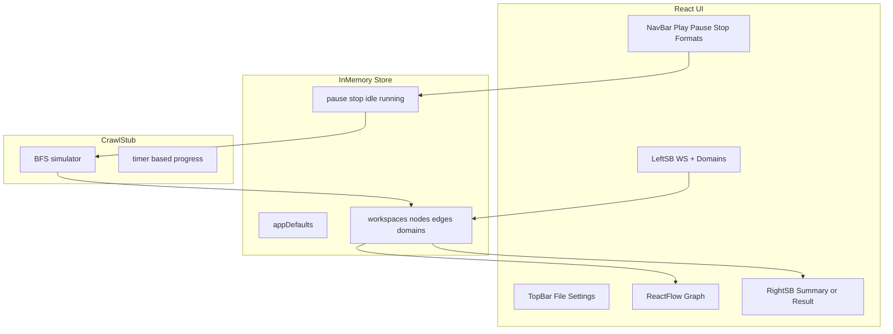

# フロントエンド実装計画（Grill 確定版）

## Grill で確定した決定一覧

| 論点 | 決定 |
|------|------|
| 実行アーキテクチャ | **Phase 1 は全面モック**（backend 統合は後回し） |
| 永続化 | **Phase 1 は useState / コンテキストのみ**（SQLite は Phase 2） |
| ノード同一性 | 正規化 URL 1 件 = ノード 1 個（重複なし） |
| 実行モード 3 | 選択ノードから**有向エッジの向き**に、**既存ノードのみ**再クロール。新規 URL は無視。枝先（出辺なし既存ノード）まで |
| 設定優先順位 | ノード > ドメイン > ワークスペース > アプリ（**フィールド単位マージ**） |
| サブツリースキップ | ノードオプション「クロールしない」→ 当該ノード + 子孫 URL を `workspace.exclude_urls` にマージ |
| エッジ | 発見リンクのみ自動生成。手動削除可・手動追加不可 |
| 一時停止 / 停止 | 一時停止=キュー停止・再開可 / 停止=キャンセル・未処理破棄 |
| エラー UI | 全体=バナー、ノード=グラフ+右 SB、クロール=右 SB サマリ |
| 右サイドバー | 未選択=実行サマリ、選択=当該ノード Result |
| ワークスペース | 複数 WS、アクティブは 1 つ |
| .scrb | JSON 群 + manifest（**Phase 2** で import/export。DB は含めない） |
| 保存形式 | `content.formats` の WS 単位オーバーライド |
| ドメイン設定 | **左 SB 下半**にドメイン一覧。選択でハイライト + 右 SB で編集 |
| 左 SB レイアウト | 上: WS 一覧 / 下: 現在 WS のドメイン一覧 |
| 実行 UI | 再生ボタン + ドロップダウンで 3 モード |
| ノード見た目 | 未訪問 / 実行中 / 成功 / エラー / スキップを枠色・アイコンで表示 |
| Phase 1 完了条件 | 3モード/FSM/エラー/設定マージ/exclude_urls まで動作確認できること |
| ノード削除 | 選択ノード + 子孫ノードを一括削除 |
| 削除時クリーンアップ | 削除対象に紐づく `exclude_urls`/ノード設定/結果キャッシュを削除 |
| URL 正規化 | query保持（キー順ソート）、fragment除去、既定ポート除去などを適用 |
| モック Result 再現度 | 本番想定 shape（`markdown/links/metadata`）を固定テンプレで返す |
| テスト方針 | コアロジック単体テスト + UI手動確認 |
| ドメイン一覧生成 | 現在WSのノード URL から host 単位で自動集約 |
| 状態管理 | Zustand |
| 設定バリデーション | Zod（必要部分スキーマ） |
| 新規ノード配置 | 新規のみ簡易配置、既存ノード位置は保持 |
| モック実行テンポ | 300〜700ms ランダム遅延 |
| ショートカット | Phase 1 はなし |
| Undo/Redo | Phase 1 は未対応、破壊操作は確認ダイアログ |
| 初期ロード | 150〜400ms スケルトン表示 |
| 文言 | 日本語固定（`messages.ts` に集約） |
| 初回起動 | `New Workspace` ダイアログを表示して作成 |
| 手動ノード追加 | 左SBボタン + グラフ右クリックの両方 |
| サブツリー削除確認 | 通常の Yes/No ダイアログ |
| エッジ削除後の再発見 | 再発見時に再生成（復活） |
| Result初期タブ | `content.formats` の先頭 |
| 実行履歴保持 | 最新20件（メモリ） |
| モード2の `exclude_urls` | 常時適用（安全制約） |
| モード3走査順 | BFS |

**モード 1 / 2 の補足（推奨どおり採用）**
- モード 1: ワークスペース起点 URL（ノード未選択でも可）
- モード 2: **選択ノード必須**、設定はアプリデフォルトのみ（WS/ドメイン/ノード上書きなし）

---

## 現状

- Wails v3 雛形: [`front/main.go`](front/main.go) + サンプル [`front/frontend/src/App.tsx`](front/frontend/src/App.tsx)
- Tailwind 4 + shadcn 初期設定済み（[`front/frontend/components.json`](front/frontend/components.json)）
- **未導入**: `@xyflow/react`（React Flow）
- backend: [`backend/internal/core/crawler.go`](backend/internal/core/crawler.go) に `ResultSink` あり。`ProgressEvent` は [設計書のみ](backend/doc/05-パイプライン詳細設計.md) で未実装

---

## 目標アーキテクチャ（Phase 1）



Phase 3（後日）では `CrawlStub` を Wails Service + `backend` in-process + Wails Events に差し替え。

---

## データモデル（TypeScript）

[`backend/configs/config.example.yaml`](backend/configs/config.example.yaml) に合わせた部分型を定義（全フィールドは不要、UI で触る範囲から）。

```ts
// 概念スキーマ（実装は types/config.ts 等）
type Config = { request; content; pdf; crawl; plugins; output } // 部分型
type AppState = { defaults: Config; workspaces: Workspace[]; activeWorkspaceId: string }
type Workspace = {
  id; name; seedUrl; settings: Partial<Config>; exclude_urls: string[];
  nodes: GraphNode[]; edges: GraphEdge[];
  domainSettings: Record<string, Partial<Config>>; // host -> overrides
}
type GraphNode = {
  id; urlNormalized; label; position; nodeSettings: Partial<Config>;
  crawlExclude: boolean; status: NodeStatus;
  lastResult?: CrawlResultPreview;
}
```

**URL 正規化**: `new URL()` + scheme/host小文字化、既定ポート除去、末尾スラッシュ正規化、fragment除去、queryキー順ソート（query保持）。

**設定マージ**: `mergeConfig(app, ws, domain, node)` を pure function で実装し、モード 2 だけ `app.defaults` を直使用。

---

## UI 構成

[`tmp_todo_for_front.md`](tmp_todo_for_front.md) の画面構成に沿ってレイアウトコンポーネントを分割:

| 領域 | コンポーネント | 備考 |
|------|----------------|------|
| 全体ロード | `AppBootstrap` | 初回のみ 150〜400ms スケルトン |
| トップバー | `MenuBar` | File: .scrb は Phase 2 で有効化し UI は disabled+tooltip |
| トップナビ | `ControlBar` | Play+Dropdown / Pause / Stop / Format multi-select（ショートカットなし） |
| 左 SB | `LeftSidebar` | 上: `WorkspaceList` / 下: `DomainList`（ノードURLから自動集約） |
| メイン | `CrawlGraph` | React Flow + カスタム `UrlNode` |
| 右 SB | `RightSidebar` | `RunSummary` / `NodeResultPanel` / `DomainSettingsPanel` |

**shadcn 追加候補**: `dropdown-menu`, `menubar`, `sidebar`（または自前 flex）, `scroll-area`, `tabs`, `badge`, `alert`, `toast`/`sonner`, `select`, `dialog`, `sheet`

**React Flow**: `@xyflow/react` を追加。`UrlNode` で URL 表示 + 状態アイコン。`onNodesChange` で位置更新、`onEdgesDelete` で手動エッジ削除。新規ノードのみ簡易配置、既存位置は保持。

---

## クロールスタブ（Phase 1 の核心）

[`front/frontend/src/services/crawlStub.ts`](front/frontend/src/services/crawlStub.ts)（新規）:

- **入力**: `RunMode`, `startNodeId?`, `workspace`, `appDefaults`, `AbortSignal`
- **処理**: BFS で既存グラフ + モードに応じた隣接探索
  - モード 1: `seedUrl` から、`crawl.enabled` 相当を WS 設定で ON 想定
  - モード 2: 選択ノードから、マージ設定は `appDefaults` のみ
  - モード 3: 選択ノードから出辺を辿り **既存ノード ID のみ**訪問（新規 URL 無視）
- **exclude**: `exclude_urls` + `crawlExclude` 子孫をスキップ（status=skipped）。モード2でも適用
- **出力イベント**（コールバック）: `nodeStarted`, `nodeSucceeded`, `nodeFailed`, `crawlCompleted`, `crawlError`
- **一時停止**: `pause()` でキュー停止、`resume()` で再開
- **停止**: `abort()` で signal 発火
- **遅延**: 1ノードごとに 300〜700ms ランダム

モック Result は本番想定 shape（`markdown/links/metadata`）を固定テンプレで返し、右 SB 表示を検証。

**3 種エラーのデモ**: スタブに `debugScenario`（optional）で全体失敗 / 特定 URL 失敗 / キュー打ち切りを発火可能に。

---

## 設定 UI

- **Settings メニュー**: アプリデフォルト編集（`config.example.yaml` 相当をフォーム or JSON エディタ。v1 は JSON テキストエリアでも可）
- **ノード選択時・右 SB**: ノード設定タブ + 「クロールしない」チェック → `exclude_urls` 更新ロジック
- **ドメイン選択時・左 SB 下半**: 右 SB にドメイン設定（`crawl.*` 中心）
- **robots.txt**: Phase 1 は表示ラベルのみ（「取得時に従う」トグルをドメイン設定に置き、スタブでは skipped 理由に `robots` を使用可能）

---

## ディレクトリ案

```
front/frontend/src/
  types/           # Config, Workspace, Graph, Crawl events
  lib/             # mergeConfig, normalizeUrl, collectDescendants
  stores/          # useAppStore (Zustand)
  schemas/         # zod schemas for config validation
  i18n/            # messages.ts (日本語固定文言)
  services/        # crawlStub.ts
  components/
    layout/        # AppShell, MenuBar, ControlBar, sidebars
    graph/         # CrawlGraph, UrlNode
    settings/      # forms / JSON editors
  App.tsx          # Provider + AppShell
```

Go 側（Phase 1）: 既存 `GreetService` は残しつつ、File ダイアログ用に将来 `OpenSCRB` / `SaveSCRB` の空サービスを追加してもよい（Phase 2）。

---

## フェーズ分割

### Phase 1 — 今回（Grill 確定スコープ）
- 依存追加: `@xyflow/react`
- Zustand store + 全画面レイアウト
- クロールスタブ + 3 モード + pause/stop FSM
- ノード状態・エラー表示・右 SB 連動
- exclude_urls / 設定マージ / ドメイン・ノード設定 UI
- サブツリー削除（Yes/No確認）+ 関連設定クリーンアップ
- 単体テスト: `mergeConfig`/URL正規化/モード3到達判定/サブツリー削除

### Phase 2 — 永続化・ファイル
- Wails Go: SQLite（アプリデータ領域）+ JSON 設定カラム
- `.scrb` zip import/export（manifest + workspace/nodes/edges JSON）
- File メニュー有効化

### Phase 3 — backend 統合
- `front` から `backend` パッケージ in-process import
- `ResultSink` / 将来の `ProgressEvent` → Wails Events
- context による pause/stop
- スタブサービスを実装に差し替え（store のイベント購読 API は維持）

---

## リスク・注意

- **todo 原文の SQLite** と Grill 回答（Phase 1 インメモリ）が矛盾 → Phase 2 へ明示的に延期
- **モード 3** は有向グラフの「子孫」定義が複雑 → `lib/graph.ts` に `getForwardReachableExisting(nodeId)` を単体テスト可能に切り出す
- `lucide-react@^1.16.0` は通常 `^0.x` — ビルドエラー時はバージョン修正
- 左 SB に WS + ドメイン両方 → 狭い幅では `min-w` と折りたたみを検討
