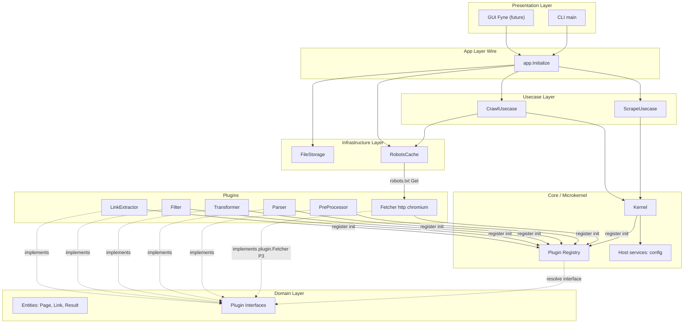
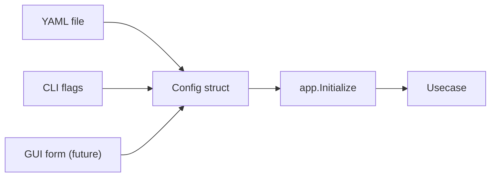
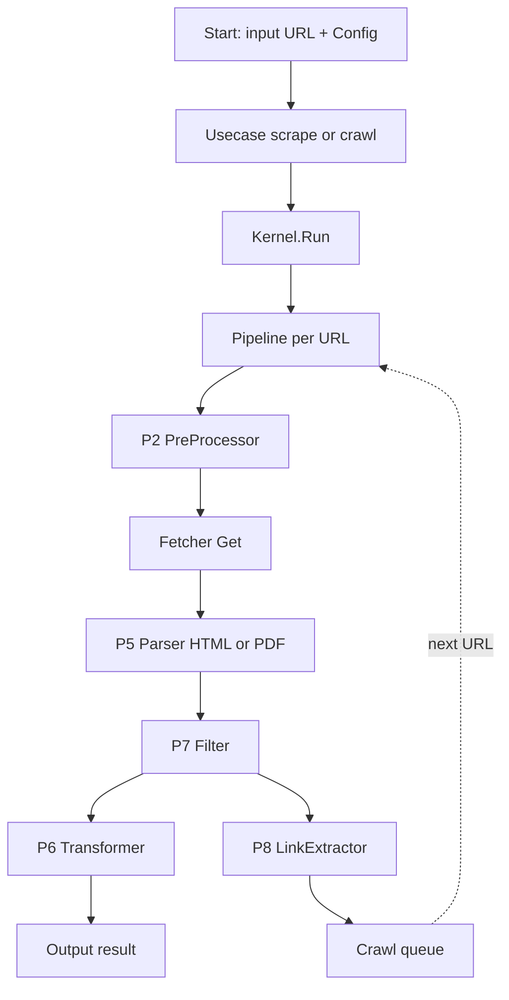

## 概要

- システム構成は **マイクロカーネルアーキテクチャ**（コンパイル時にプラグインを `init()` 登録で組み込む方式）。
- フォルダ構造は **レイヤードアーキテクチャ**（presentation / usecase / domain / infrastructure）に揃え、依存方向を内向きに固定する。
- 当面の実行は `cmd/<app>/main.go` で動作確認するが、プレゼンテーション層を抽象化することで後日 Fyne デスクトップアプリへ載せ替えできる構造とする。
- 本章はディレクトリ構成・依存ルール・データフローまでを確定する。各コンポーネントの内部仕様は後続詳細設計章に委ねる。

## 詳細

### アーキテクチャ全体像

- 中心は最小コア（カーネル）。カーネルは具体プラグインを `import` しない。
- プラグインは抽象 interface（`domain` 層）に依存し、自身を `core` のレジストリへ `init()` で登録する。
- プレゼンテーション層（CLI / Fyne）は `internal/app` 経由でユースケースを呼び出し、内部実装に踏み込まない。
- 依存グラフの組み立ては **Google Wire** による composition root（`internal/app`）で行う。プラグインの `init()` 登録方式は変更しない。



### ディレクトリ構成

[[Goマイクロカーネルアーキテクチャ]] のレイアウトを下敷きに、レイヤード分割を反映したディレクトリ構成を採用する。

```text
scraperbot/
├── cmd/
│   └── scraperbot/
│       └── main.go                 # CLI エントリーポイント。プラグインの副作用importもここで宣言。
├── internal/
│   ├── presentation/               # プレゼンテーション層
│   │   ├── cli/                    # CLI 実装（flag/cobra等）
│   │   │   └── cli.go
│   │   └── gui/                    # Fyne GUI（将来。当面は空ディレクトリ or 雛形のみ）
│   │       └── .gitkeep
│   ├── app/                        # Wire composition root（依存グラフ組み立て）
│   │   ├── app.go                  # Application 構造体
│   │   ├── providers.go            # Wire Provider 関数
│   │   ├── wire.go                 # wireinject 定義
│   │   └── wire_gen.go             # wire 生成物
│   ├── usecase/                    # ユースケース層
│   │   ├── scrape.go               # 単一URLスクレイピング
│   │   └── crawl.go                # 複数URLクロール
│   ├── domain/                     # ドメイン層（抽象のみ）
│   │   ├── model/                  # エンティティ・値オブジェクト
│   │   │   ├── page.go
│   │   │   ├── link.go
│   │   │   └── result.go
│   │   └── plugin/                 # プラグイン抽象 interface
│   │       ├── plugin.go           # 共通 Plugin / Host interface
│   │       ├── fetcher.go          # P3 Fetcher
│   │       ├── preprocessor.go     # P2 PreProcessor
│   │       ├── parser.go           # P5 Parser
│   │       ├── transformer.go      # P6 Transformer
│   │       ├── filter.go           # P7 Filter
│   │       └── linkextractor.go    # P8 LinkExtractor
│   ├── core/                       # マイクロカーネル本体
│   │   ├── kernel.go               # 起動/終了の制御、依存解決
│   │   ├── registry.go             # プラグイン登録/取得
│   │   ├── host.go                 # Plugin に渡す Host 実装
│   │   ├── pipeline.go             # スクレイピングパイプライン実行
│   │   └── crawler.go              # クロール制御（深度・並行・robots）
│   ├── logger/                     # slog 標準ロガーのグローバル初期化
│   │   └── logger.go
│   └── infrastructure/             # インフラ層（外部I/O実装）
│       ├── storage/                # ファイル保存
│       │   └── file.go
│       └── robots/                 # robots.txt キャッシュ・判定（取得は Fetcher 経由）
│           └── robots.go
├── plugins/                        # 具体プラグイン実装
│   ├── fetcher-http/            # P3: 標準 HTTP 取得
│   ├── fetcher-chromium/        # P3: chromedp 取得
│   ├── preprocessor-header/        # P2: 共通ヘッダ付与
│   ├── parser-html/                # P5: HTMLパーサー
│   ├── parser-pdf/                 # P5: PDFパーサー（リンク先PDF対応）
│   ├── transformer-markdown/       # P6: HTML→Markdown
│   ├── filter-maincontent/         # P7: メインコンテンツ抽出
│   ├── filter-selector/            # P7: CSSセレクタフィルタ
│   ├── filter-tag-include/         # P7: include_tags ベースのタグ許可
│   ├── filter-tag-exclude/         # P7: exclude_tags ベースのタグ除外
│   └── linkextractor-default/      # P8: <a href> 抽出 + パス正規化
├── configs/
│   └── config.example.yaml         # 設定ファイル例
├── go.mod
└── go.sum
```

- `cmd/scraperbot/main.go` のみが具体プラグインを `_` インポートし、ビルドに組み込む。
- `internal/` 配下を Go の `internal` 仕様で外部利用から遮断する（このリポジトリ専用）。
- 将来の Fyne GUI 化は `internal/presentation/gui/` を追加し、`cmd/scraperbot-gui/main.go` を別途用意することで、CLI 版とユースケース層以下を完全に共有できる。

### レイヤー責務と依存ルール

| レイヤー | 責務 | 依存可能な相手 |
| --- | --- | --- |
| `presentation` | 入出力の窓口。CLI のフラグ解析、GUI のイベントを `app.Initialize` 呼び出しに変換する。 | `app`, `domain/model` |
| `app` | Wire による composition root。Host / Kernel / Usecase / Infrastructure を一括組み立てる。 | `usecase`, `core`, `infrastructure`, `domain` |
| `usecase` | ユーザー視点のシナリオを束ねる。設定とリクエストを受け取り、カーネルへ実行を委譲する。 | `domain`, `core` |
| `domain` | エンティティ・値オブジェクト・抽象 interface のみ。Goの標準ライブラリ以外に依存しない。 | （依存なし） |
| `core` | カーネル、プラグインレジストリ、パイプライン、クロール制御。 | `domain`, `infrastructure` |
| `infrastructure` | ファイル保存・robots キャッシュ等の外部I/O実装（Fetch 本体は持たない）。 | `domain` |
| `plugins/*` | 具体プラグイン実装（P2〜P8）。P3 Fetcher の net/http・chromedp 実装もここに置く。`init()` で `core` のレジストリへ登録。 | `domain`, `core`（登録のみ） |

依存方向の原則は以下に固定する。

- `domain` は誰にも依存しない（最内）。
- `usecase` / `infrastructure` / `core` は `domain` に依存する。
- `core` は `infrastructure` を利用してよい。
- `app` は composition root として `usecase` / `core` / `infrastructure` / `domain` を横断 import してよい。
- `presentation` は `app` と `domain/model` のみに依存する。
- `plugins/*` は `domain` 抽象を実装し、`core` のレジストリ登録APIにのみ依存する（`infrastructure` への依存は持たない）。
- `cmd/` だけが具体プラグインを `_` import する。

### プレゼンテーション層の方針

- 当面の動作確認は `cmd/scraperbot/main.go` から CLI（`internal/presentation/cli`）を呼び出す形にする。
- CLI と GUI の双方は **`app.Initialize(ctx, cfg)` を共有** し、返却された `Application` 経由でユースケースを呼ぶ。`usecase` は `presentation` 種別を意識しない。
- 進捗通知やイベントは GUI 化を見越して **コールバック or chan ベース** で `usecase` から渡せるようにする（同期戻り値だけにしない）。
- Fyne への移行手順の想定:
    1. `internal/presentation/gui/` 配下に Fyne UI を実装。
    2. `cmd/scraperbot-gui/main.go` を追加し、CLI と同じ `app.Initialize` を bind する。
    3. CLI 版バイナリは引き続き `cmd/scraperbot` から生成。

### 設定の流れ

- 設定の供給経路は次の2系統に統一する。
  - YAML設定ファイル（`--config path`）
  - コマンドラインフラグ（個別上書き）
- どちらも最終的に `domain/model` の **同一の Config 構造体** に正規化する。
- GUI 化後はフォーム入力結果が同じ Config 構造体になる。設定の単一の真実源は構造体であることを保証する。



### データフロー概観

単一URLのスクレイピング（UC-1）と、クロール（UC-2）における大まかなデータフローは次のとおり。詳細は `[[05-パイプライン詳細設計]]` で確定する。



- URL 取得（P3）は `plugins.fetcher`（`http` / `chromium`）で選択。`plugins/fetcher-*` が registry + `Init` で組み込まれる。
- robots.txt 取得も Kernel 初期化済みの同一 P3 Fetcher を `robots.Cache` 経由で利用する。
- PDFリンク対応は P5 段階で「リンク先がPDFの場合は PDFパーサーへ振り分ける」コア側の固定ロジック + `plugins/parser-pdf` の組合せで実現する。

### 起動順とライフサイクル

- 起動順:
    1. CLI フラグ解析 / 設定ファイル読込
    2. `Config` 構築・バリデーション
    3. `logger.Init` で `slog.SetDefault` によりアプリ全体の標準ロガーを初期化
    4. `app.Initialize(ctx, cfg)` で Host / Kernel / Usecase / Infrastructure を一括構築（内部で `Kernel.Init` が P2 → P3 → P5 → P6 → P7 → P8 の順に実行される）
    5. ユースケース実行（パイプライン or クローラ）
    6. 終了シグナル受信時、cleanup 関数経由で `Kernel.Close(ctx)`（登録の逆順）
- 失敗ポリシー:
  - プラグイン `Init` 失敗 → 致命扱いで起動中止。
  - パイプライン中の個別ページ失敗 → スキップしてログ。クロール継続。
  - 設定不正 → 起動前に検出し終了。

### 拡張シナリオ

- 機能追加（例: 別の HTML→Markdown 変換器の差し替え）
  - `plugins/transformer-markdown-alt/` を作成し、`init()` で `RegisterTransformer("markdown-alt", ...)` 登録。
  - `cmd/scraperbot/main.go` の副作用 import を1行追加。
  - 設定で `transformer: markdown-alt` を指定すれば有効化される。
- プレゼンテーション層拡張（CLI → Fyne）
  - `internal/presentation/gui/` を追加。
  - `cmd/scraperbot-gui/main.go` を追加。
  - usecase・core・plugins 側に変更不要。

### 受け入れ条件

- `domain` パッケージが Go 標準パッケージ以外の外部依存を含まない。
- `core` パッケージが `plugins/*` を import していない。
- `cmd/scraperbot/main.go` のみが具体プラグインを副作用 import している。
- CLI と将来の GUI が **`app.Initialize` 経由で同一のユースケース** を共有する。
- ディレクトリ構成は上記のとおり（`internal/app/` を含む）であり、レイヤー越境の依存はビルド時 import ツリー（`go list -deps`）で確認可能。

### 関連ノート

- [[Goマイクロカーネルアーキテクチャ]]
- [[01-要件整理]]
- [[03-設定詳細設計]]
- [[04-プラグインシステム詳細設計]]
- [[05-パイプライン詳細設計]]

#Go #スクレイピング #設計書 #アーキテクチャ #マイクロカーネル #レイヤード
