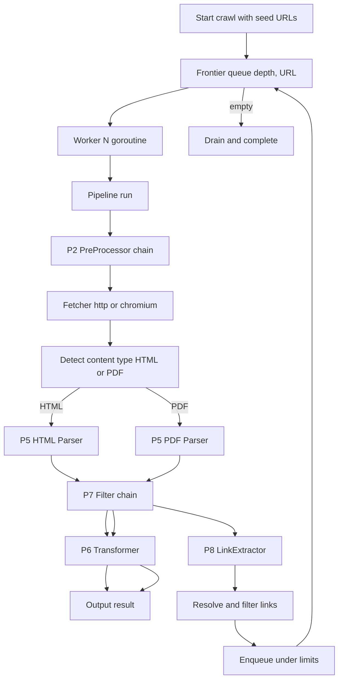
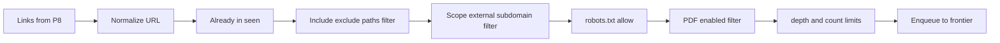

## 概要

- 1URLあたりのスクレイピング処理（パイプライン）と、複数URLを巡回するクローリング（並行制御）の挙動を確定する。
- プラグイン実行ポイント P2 / P5 / P6 / P7 / P8 の入出力仕様、エラーポリシー、PDFリンクへの振り分け、robots.txt の扱いをここで固定する。
- 設計対象は `internal/core/pipeline.go` と `internal/core/crawler.go`。本章を満たせば、ユースケース層（`internal/usecase`）はパイプライン/クローラに対する細かな指示を一切持たずに済む。

## 詳細

### 全体フロー

クローラは BFS で URL を取り出し、ワーカープールで並行的にパイプラインを実行する。



### パイプライン（1URLあたり）

#### 1. P2: PreProcessor チェーン実行

- 入力: `*model.Request`（URL、メソッド、初期ヘッダ、深度、Meta）。
- 動作: 設定 `plugins.preprocessors` で並んだ順に `PreProcess(ctx, req)` を呼ぶ。
- 出力: 副作用として `req` を変更する。返り値は `error` のみ。
- 典型用途:
  - 共通ヘッダ（User-Agent, Authorization）の付与
  - User-Agent ローテーション
  - 認証トークン注入
  - 簡易レートリミット（`time.Sleep`）
- エラーポリシー: いずれかの PreProcessor がエラー → 当該URLを失敗扱い、次URLに進む。

#### 2. URL 取得（Fetcher 選択）

- 入力: 前段で完成した `*model.Request`。
- 選択: `plugins.fetcher`（既定 `http`）。`core.NewFetcherFromConfig` がレジストリから生成する。
    - `http`: `plugins/fetcher-http` が登録。実体は `infrastructure/httpclient`。
    - `chromium`: `plugins/fetcher-chromium` が登録。実体は `infrastructure/chromefetcher`。
- 専用設定: `plugins.fetcher_config`（chromium 時）
    - `browser_path`: ブラウザ実行ファイルの明示指定（空なら自動検出）。
    - `user_agent`: UA 明示（空なら `request.headers` または既定 Chromium UA）。
    - `headless`: ヘッドレス実行（既定 `true`）。
    - `wait_visible_selector` / `wait_timeout`: 取得前の要素待機。
- ブラウザ実行ファイルの探索順（chromium 時）:
    1. `plugins.fetcher_config.browser_path`（または CLI `--fetcher-browser-path`）
    2. 環境変数 `SCRAPERBOT_CHROMIUM_PATH`
    3. Chromium 系候補（`chromium`, `chromium-browser`, `google-chrome` 等）
    4. Edge 系候補（`microsoft-edge`, `msedge` 等）
- リトライ:
    - `RequestConfig.RetryCount` 回まで再試行。
    - `http`: 対象は `5xx`、ネットワークエラー、タイムアウト。
    - `chromium`: ナビゲーション失敗・タイムアウト等（`context` キャンセルは非リトライ）。
    - `RequestConfig.RetryInterval` 待機後に再試行（指数バックオフは今回採用しない）。
- タイムアウト:
    - `context.WithTimeout(parent, RequestConfig.Timeout)` を各取得に付与。
- 結果: `*model.Response`（ステータス、ヘッダ、Content-Type、Body、`FetchedAt(time.Time)`）。
    - `chromium` 時の `StatusCode` はレンダリング成功時 `200` 固定。`Content-Type` は `text/html`。
- robots.txt 取得も **ページ取得と同じ Fetcher** を使用する（`robots.Cache` が `core.Fetcher.Get` を呼ぶ）。`chromium` 選択時は robots.txt も chromium 経由となる。
- `chromium` 選択時、P2〜P8 プラグイン向け `Host.HTTP()` は `core.ResolveHostHTTP` により http Fetcher を別途解決する。
- エラーポリシー: 規定回数失敗 → 当該URL失敗。ログに最終エラーを記録。

#### 3. コンテンツ種別検出（コア固定）

- 入力: `*model.Response`。
- 判定順:
    1. レスポンスの `Content-Type`（`application/pdf` → PDF、`text/html` / `application/xhtml+xml` → HTML）。
    2. URLの拡張子（`.pdf` → PDF、`.html` / 拡張子なし → HTML）。
    3. それ以外は **登録されている Parser 群を順に `CanParse(res)` で問い合わせ**、最初に true を返したものを採用。
- 結果: 採用された `plugin.Parser` 1つ。
- 設定 `pdf.enabled = false` の場合は PDF と検出されてもパイプラインを打ち切り（クロール側でリンクとして拾わない方針）。

#### 4. P5: Parser 実行

- 入力: `*model.Response`、選択された `plugin.Parser`。
- 動作: `Parse(ctx, res)` を実行し `*model.Content` を返す。
- HTML パーサー（`plugins/parser-html`）
  - goquery で DOM 構築。
  - `Content.Format = "html"`、`Content.DOM = *goquery.Document`、`Content.Text` は本文プレーンテキスト。
  - メタデータ（title, description, OGP）を `Content.Metadata` に格納。
- PDF パーサー（`plugins/parser-pdf`）
  - `pdf.mode` に従って動作:
      - `fast`: 埋め込みテキストのみ抽出。空のページは空文字。
      - `auto`: `fast` を試み、テキスト抽出量がしきい値未満（例: 50 文字未満）のページは OCR にフォールバック。
      - `ocr`: 全ページ強制 OCR。
  - `pdf.max_pages > 0` の場合、先頭 N ページのみ処理。
  - `Content.Format = "pdf"`、`Content.Text = "ページ番号 + 抽出テキスト"` の連結。
  - `pdf.output = raw` の場合、`Content.Attachments` に元バイナリを格納。
- エラーポリシー: Parse 失敗 → 当該URL失敗。

#### 5. P7: Filter チェーン実行

- 入力: `*model.Content`。設定 `plugins.filters` の順に適用。
- 動作: 各 Filter の `Filter(ctx, c)` を呼び、返り値の `*model.Content` を次の Filter に渡す。
- 代表 Filter:
    - `maincontent`: ヘッダー・フッター・ナビ・script/style/noscript を除去。
    - `selector`: `content.selector` が指定されているとき、その配下のみを残す。
    - `tag-include` / `tag-exclude`: `include_tags` / `exclude_tags` に基づくタグ単位フィルタ。
- 注意: Filter は変換ではなく **絞り込み**。HTML→Markdown は P6 で行う。
- エラーポリシー: いずれかの Filter エラー → 当該URL失敗。

#### 6. P6: Transformer 実行

- 入力: フィルタ済み `*model.Content`、設定 `plugins.transformer`。
- 動作: 単一の Transformer の `Transform(ctx, c)` を呼ぶ。
- 出力: `*model.Result`（Markdown / HTML / RawHTML / JSON / Links / Metadata のうち、設定 `content.formats` で要求された項目だけが埋められる）。
- HTML 系コンテンツのフォーマット対応:
    - `markdown`: HTML→Markdown。
    - `html`: フィルタ後 HTML。
    - `raw_html`: 元レスポンスのまま（フィルタ・変換非適用）。
    - `json`: title / metadata / text の構造化 JSON。
    - `links`: P8 抽出結果を後段で結合する。
    - `metadata`: メタデータのみ。
- PDF 系コンテンツのフォーマット対応:
    - `markdown`: ページ見出し + 本文を Markdown 化。
    - `html`: 各ページを `<section>` で包んだ簡易 HTML。
    - `raw_html`: 非対応（警告ログ）。
    - `json`: ページ番号付きテキスト配列。
    - `links`: PDF 内リンク（埋め込みリンクが取得できる場合のみ）。
    - `metadata`: タイトル・著者など PDF メタデータ。

#### 7. P8: LinkExtractor 実行

- 入力: フィルタ済み `*model.Content`、起点URL。
- 動作: `Extract(ctx, c, baseURL)` で `[]*url.URL` を返す。
- 既定実装（`plugins/linkextractor-default`）:
    - HTML の場合: `<a href>` を全件抽出し、`url.URL` 解決を行う。
    - PDF の場合: 埋め込みリンクを抽出（取得不能なら空）。
- 出力リンクの後処理（クローラ側固定処理、本章「リンクフィルタリング」参照）:
    - 同一フラグメントの除去、トレーリングスラッシュ正規化。
    - クロール設定（include/exclude、外部、サブドメイン）に基づくふるい分け。
- エラーポリシー: LinkExtractor 失敗 → リンク追加なしで継続（当該ページ自体は成功扱い）。

### PDFリンクへの振り分け仕様

要件「リンク中の PDF は読み取れるようにする」を満たす実装方針。

- P8 で抽出された `*url.URL` のうち、以下のいずれかを満たすものを **PDFリンク** とする:
    - URLパスが `.pdf` で終わる。
    - HEAD リクエストの `Content-Type` が `application/pdf`（HEAD はオプション。デフォルトでは行わない）。
- PDFリンクはクローラのフロンティアに通常通り追加される。
- フロンティアから取り出された後、パイプライン内の **コンテンツ種別検出（手順3）** が `Content-Type` / 拡張子から PDF と判定し、PDF パーサーへ振り分けられる。
- これにより、特別な分岐パスを設けずに「リンク中の PDF を辿って読み取る」を実現する。

設定との関係:

- `pdf.enabled = false`: PDFリンクをフロンティアから除外する（クロール時のリンクフィルタで弾く）。
- `pdf.enabled = true`: 通常リンクと同様にクロール対象。深度・最大件数の制約は適用される。

### クローラ設計

#### 状態とデータ構造

```go
// internal/core/crawler.go
package core

import (
    "context"
    "net/url"
    "regexp"
    "sync"
    "time"

    "scraperbot/internal/domain/model"
)

type Crawler struct {
    cfg     *model.Config
    kernel  *Kernel

    seen    sync.Map // map[string]struct{} normalized URL
    countMu sync.Mutex
    count   int

    includeRe []*regexp.Regexp
    excludeRe []*regexp.Regexp

    fetcher  Fetcher         // ページ取得
    pipeline *Pipeline
    robots   RobotsChecker  // robots.txt 判定（nil 可）
}

type job struct {
    url   *url.URL
    depth int
}

type CrawlStats struct {
    Enqueued  int
    Succeeded int
    Failed    int
    Skipped   int
}
```

#### 起動シーケンス

1. `Crawler.Run(ctx, seeds)` 呼び出し。
2. include/exclude を `regexp.MustCompile`。
3. ワーカー数 `crawl.max_concurrency` で goroutine を起動。
4. シード URL を `enqueue(seed, 0)`。
5. 各ワーカーは `job` を受け取り、パイプラインを実行。
6. パイプライン後、P8 が返したリンクを `enqueue(link, depth+1)`。
7. キューが空かつ全ワーカー idle で終了。
8. `Kernel.Close` を呼んでプラグインを停止。

#### ワーカープール実装方針

- `enqueue` は直接 `jobs` に送らず、**無制限キュー（スライス）を持つ dispatcher goroutine** に投入する。
- dispatcher が内部キュー先頭を `jobs chan job` に順次流すことで、`enqueue` 側のブロックを避ける。
- `sync.WaitGroup` で全ジョブの完了を追跡する。
- `pending` の増減と `close` 判定は `sync.Mutex` で排他し、`enqueue` と終了判定の競合を防ぐ。
- 並行数は `crawl.max_concurrency`。`crawl.request_delay > 0` の場合は **1 に強制**（設定段階で警告ログ）。

```go
func (c *Crawler) Run(ctx context.Context, seeds []*url.URL) (*CrawlStats, error) {
    workerN := c.cfg.Crawl.MaxConcurrency
    if c.cfg.Crawl.RequestDelay > 0 {
        workerN = 1
    }

    jobs := make(chan job, workerN*2)
    pushQ := make(chan job, 256)
    stats := &CrawlStats{}
    var (
        stateMu sync.Mutex
        pending int
        closed  bool
    )

    queueDone := make(chan struct{})
    go func() {
        defer close(queueDone)
        q := make([]job, 0, 1024)
        for {
            var (
                out chan job
                head job
            )
            if len(q) > 0 {
                out = jobs
                head = q[0]
            }
            select {
            case <-ctx.Done():
                close(jobs)
                return
            case j, ok := <-pushQ:
                if !ok {
                    for len(q) > 0 {
                        select {
                        case <-ctx.Done():
                            close(jobs)
                            return
                        case jobs <- q[0]:
                            q = q[1:]
                        }
                    }
                    close(jobs)
                    return
                }
                q = append(q, j)
            case out <- head:
                q = q[1:]
            }
        }
    }

    finishOne := func(ok bool) {
        stateMu.Lock()
        defer stateMu.Unlock()
        pending--
        if ok {
            stats.Succeeded++
        } else {
            stats.Failed++
        }
        if pending == 0 && !closed {
            closed = true
            close(pushQ)
        }
    }

    enqueue := func(u *url.URL, depth int) bool {
        if !c.shouldVisit(u, depth) {
            stateMu.Lock()
            stats.Skipped++
            stateMu.Unlock()
            return false
        }
        stateMu.Lock()
        defer stateMu.Unlock()
        if closed {
            return false
        }
        pending++
        stats.Enqueued++
        pushQ <- job{url: u, depth: depth}
        return true
    }

    var wg sync.WaitGroup
    for i := 0; i < workerN; i++ {
        wg.Add(1)
        go func() {
            defer wg.Done()
            for j := range jobs {
                ok := c.runOne(ctx, j, enqueue)
                if c.cfg.Crawl.RequestDelay > 0 {
                    time.Sleep(c.cfg.Crawl.RequestDelay)
                }
                finishOne(ok)
            }
        }()
    }

    for _, s := range seeds {
        enqueue(s, 0)
    }
    wg.Wait()
    <-queueDone
    return stats, nil
}
```

- `pushQ` を閉じる判定は `pending == 0` かつ `closed == false` を mutex 下で評価する。これにより「送信側が追加中に close される」競合を防ぐ。
- `jobs` の close は dispatcher goroutine だけが担当し、マルチワーカーからの重複 close を禁止する。

#### 訪問条件 `shouldVisit`

- 既訪問チェック（`seen` に正規化URLが入っていないか）。
- 深度チェック（`depth <= crawl.max_depth`）。
- 件数チェック（`crawl.max_pages` を超えていないか。チェック後インクリメント）。
- スキーム制限（`http` / `https` のみ）。
- ドメイン制限:
    - `allow_external_links = false`: 起点ホストと同じ登録ドメインのみ。
    - `allow_subdomains = true`: 同じ登録ドメインの異なるサブドメインを許可。
- パスパターン:
    - `include_paths` 指定時、いずれかに一致しない URL は除外。
    - `exclude_paths` 指定時、いずれかに一致する URL は除外。
    - パターンは **URL の path** に対して評価（クエリ除外）。
- PDF 除外:
    - `pdf.enabled = false` の場合、PDF 判定リンクを除外。
- robots.txt 適用（次節）。

#### URL 正規化

- スキーム小文字化、ホスト小文字化。
- デフォルトポート（80/443）の除去。
- フラグメント（`#section`）除去。
- トレーリングスラッシュは「ホスト直下のみ削除しない」その他は維持（誤マッチ防止）。
- クエリ順序の安定化は **行わない**（仕様簡素化のため、同一パス・異なるクエリは別 URL と見なす）。

#### robots.txt の扱い

- `crawl.respect_robots_txt = true`（既定）の場合のみ評価。
- 取得は **ホスト初回アクセス時に一度だけ**。`RobotsCache` がプロセス内で保持。
- 取得: `robots.Cache` が `Fetcher.Get` で `/robots.txt` を取得（ページ取得と同じ Fetcher）。
- 取得失敗時の挙動:
    - 404: 全許可とみなす。
    - 5xx: 全許可とみなす。
    - その他のエラー: 全許可とみなす（利用性優先）。警告ログを残す。
- 評価対象 User-Agent: `request.headers["User-Agent"]`（未設定なら `*`）。
- 不許可と判定された URL は `enqueue` 内 `shouldVisit` で `Skipped` とし、`seen` には登録しない。
- 判定タイミング: リンクの `enqueue` 時（シード URL も同経路）。
- 既定ライブラリ候補: `github.com/temoto/robotstxt`。

#### リンク追加までの処理パス



#### 単一URLモード

- `crawl.enabled = false` のとき、フロンティア処理は使わず、シードに対してパイプラインを1回だけ実行する。
- 並行数・遅延・robots.txt 等のクロール固有設定はすべて無視。
- 戻り値は単一の `*model.Result`。

#### `Crawler.Run` の戻り値

- `Crawler.Run` は `(*CrawlStats, error)` を返す。
- `CrawlStats` には `Enqueued` / `Succeeded` / `Failed` / `Skipped` を含め、呼び出し元（CLI / GUI）が最終サマリを表示できるようにする。
- `error` は「起動不能・設定不備・コンテキスト異常終了」などクロール全体の失敗のみで返し、ページ単位の失敗は `CrawlStats.Failed` に集約する。

### P2〜P8 の入出力サマリ

| ポイント | 入力 | 出力 | 失敗時の単位 |
| --- | --- | --- | --- |
| P2 PreProcessor | `*model.Request` | `*model.Request`（副作用） | 当該URL失敗 |
| P5 Parser | `*model.Response` | `*model.Content` | 当該URL失敗 |
| P6 Transformer | `*model.Content` | `*model.Result` | 当該URL失敗 |
| P7 Filter | `*model.Content` | `*model.Content` | 当該URL失敗 |
| P8 LinkExtractor | `*model.Content` + baseURL | `[]*url.URL` | 当該URLは成功・リンク追加なし |

### 並行処理と Context 伝播

- すべての処理は `context.Context` を引き継ぐ。
- ルートコンテキストはユースケース層で生成し、シグナル（`SIGINT` / `SIGTERM`）でキャンセル可能。
- 各 HTTP 取得は `context.WithTimeout(parent, request.Timeout)` を派生させる。
- キャンセルされた時:
    - 処理中ワーカーは現在のページを最後まで完了させない（ベストエフォート）。
    - フロンティアに残るジョブは破棄。
    - クローラは `Kernel.Close` を呼んで終了。

### 進捗通知（GUI 拡張に備える）

- クローラは進捗イベントを `chan ProgressEvent` で外部に送る。`usecase` 経由で `presentation` 層に伝達。
- イベント種別:
    - `started`（URL）
    - `fetched`（URL, status）
    - `succeeded`（URL, formats）
    - `failed`（URL, error）
    - `completed`（statistics）
- CLI 実装は標準エラーへ整形ログ出力。GUI 実装はプログレスバー・リスト更新に利用。
- イベントを購読しない呼び出しのために、チャネル送信は非ブロッキング（バッファ + ドロップ）で実装。

### 出力（コア固定）

- `*model.Result` を `OutputConfig.Dir` 配下に書き出す。
- ファイル名は `OutputConfig.FilePattern` で生成。
    - `{seq}`: 0始まりの連番（5桁ゼロ埋め）
    - `{host}`: URL ホスト名
    - `{path}`: URL パスを `/` `?` `&` `=` のサニタイズして連結
    - `{ext}`: フォーマットに応じた拡張子（`md` / `html` / `json` / `txt`）
- 複数フォーマット指定時はフォーマットごとに別ファイルで保存。
- 単一URLモードかつフラグ指定がない場合は **標準出力**に Markdown を出力する CLI 動作を許可する。

### エラーポリシーまとめ

| 事象 | 挙動 |
| --- | --- |
| プラグイン Init 失敗 | 起動中止（致命） |
| HTTP リトライ後失敗 | 当該URL失敗、ログ、次へ |
| Parser 全滅 | 当該URL失敗、ログ、次へ |
| Filter / Transformer 失敗 | 当該URL失敗、ログ、次へ |
| LinkExtractor 失敗 | 当該URLは成功扱い、リンク追加なし |
| robots.txt 不許可 | フロンティアに追加しない |
| context キャンセル | 全ワーカー停止、フロンティア破棄、Close 実行 |

### 受け入れ条件

- 単一URLモードで Markdown 1ファイル / 標準出力が得られる。
- クロールモードで `max_depth=2`, `max_pages=100`, `max_concurrency=4` の制約を尊重する。
- ページ内に `.pdf` リンクが含まれる場合、PDF パーサーが起動し、テキストが抽出される。
- robots.txt の不許可 URL を踏まない（`respect_robots_txt = true` のとき）。
- 任意のページの失敗が、他ページの処理継続を妨げない。
- `context.Cancel` で 1 秒以内（最大: 進行中の HTTP の Timeout まで）に全ワーカーが停止する。
- `Crawler.Run` の戻り値 `CrawlStats` で成功件数・失敗件数・スキップ件数が取得できる。

### 未決事項

- リトライのバックオフ戦略を「固定間隔」から「指数バックオフ + jitter」に変更するかは未決。
- 進捗イベントのスキーマを Protocol Buffers / 単純な struct のどちらにするかは未決（GUI 実装時に確定）。
- HEAD リクエストによる PDF 判定の採用可否（精度向上 vs リクエスト増加のトレードオフ）。

### 関連ノート

- [[01-要件整理]]
- [[02-アーキテクチャ概要]]
- [[03-設定詳細設計]]
- [[04-プラグインシステム詳細設計]]
- [[Goマイクロカーネルアーキテクチャ]]

#Go #スクレイピング #設計書 #パイプライン #クローラ #並行処理
